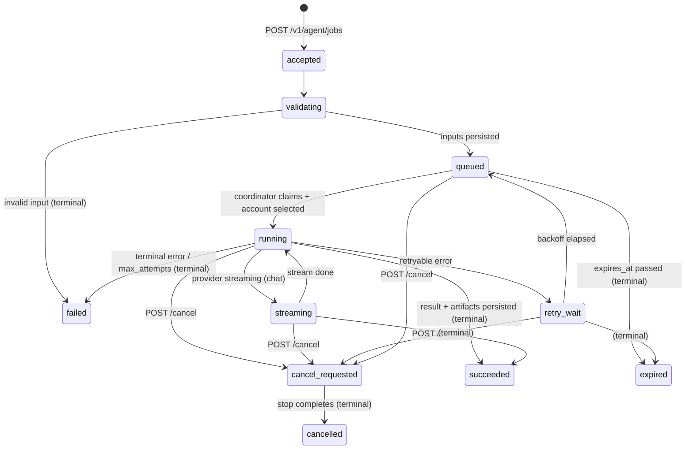

# Data Model — AI Agent → ChatGPT API Bridge

> **Status: Phase 1A persistence + Phase 1B HTTP routes implemented,
> Phase 1C.1 retry persistence primitives implemented, and Phase 1C.2
> coordinator lifecycle/recovery polling shipped** in
> `chatgpt_api/api/agent_jobs.py`,
> `chatgpt_api/api/agent_job_routes.py`,
> `chatgpt_api/api/agent_job_coordinator.py`, and
> `BridgeAdminStore._migrate()` (2026-06-27). The tables, indexes, state
> machine, idempotency, claim/lease, recovery sweep, durable `retry_wait`
> scheduling, due-retry promotion primitives, queued/non-running
> cancellation finalization, and redaction below are shipped and covered by
> `tests/test_agent_jobs.py` + `tests/test_agent_job_coordinator.py`.
> Provider execution and streaming-delta events remain deferred (Phase 1C.3+).
>
> Implemented as idempotent `CREATE TABLE IF NOT EXISTS` in
> `BridgeAdminStore._migrate()` (`admin_store.py`) — no migration framework
> exists (`CLAUDE.md` §11). Forward-only; **no down-migration**.

## Migration strategy

- Add the new tables in `_migrate()` with `CREATE TABLE IF NOT EXISTS` +
  `CREATE INDEX IF NOT EXISTS` — same pattern as `artifacts`/
  `account_captures`/`settings`.
- Reuse the existing `artifacts` table for job artifacts (one row per
  generated file) so the existing download path
  `/v1/chatgpt/files/{file_id}/{filename}` works unchanged. Add a
  `job_id` column to `artifacts` (nullable, default NULL) to associate
  artifacts with jobs without breaking existing rows.
- All queries parameterized (`?` placeholders) — keep `CLAUDE.md` §11.
- Each store call opens its own connection (existing pattern); no pooling.

## 1. `agent_jobs` (Phase 1)

| Column | Type | Req | Notes |
| --- | --- | --- | --- |
| `job_id` | TEXT | PK | `job_` + ULID-like |
| `client_request_id` | TEXT | opt | caller correlation |
| `idempotency_key` | TEXT | opt | unique when present |
| `request_hash` | TEXT | opt | sha256 of canonical request |
| `request_type` | TEXT | req | `chat`/`image_generation`/`image_edit`/`vision`/`deep_research` |
| `status` | TEXT | req | state machine value |
| `priority` | INTEGER | req | default 0 (Phase 2) |
| `model` | TEXT | req | alias |
| `account_alias` | TEXT | opt | chosen account |
| `request_storage_key` | TEXT | req | relative path to `request.json` |
| `created_at` | TEXT | req | ISO8601 UTC |
| `queued_at` | TEXT | opt | |
| `started_at` | TEXT | opt | |
| `completed_at` | TEXT | opt | |
| `cancel_requested_at` | TEXT | opt | |
| `cancelled_at` | TEXT | opt | |
| `expires_at` | TEXT | opt | |
| `attempt_count` | INTEGER | req | default 0 |
| `max_attempts` | INTEGER | req | from policy |
| `error_code` | TEXT | opt | |
| `error_message` | TEXT | opt | redacted |
| `result_id` | TEXT | opt | FK→`job_results.result_id` |
| `callback_url` | TEXT | opt | Phase 3 |
| `callback_status` | TEXT | opt | Phase 3 |
| `lease_owner` | TEXT | opt | process id (Phase 1 restart recovery) |
| `lease_expires_at` | TEXT | opt | heartbeat deadline |
| `next_retry_at` | TEXT | opt | durable retry deadline while `status=retry_wait` |

- **Indexes:** `agent_jobs_status_idx (status)`,
  `agent_jobs_created_idx (created_at DESC)`,
  `agent_jobs_idem_idx (idempotency_key)` (unique where present),
  `agent_jobs_client_idx (client_request_id)`,
  `agent_jobs_retry_idx (status, next_retry_at)`.
- **Unique:** partial unique on `idempotency_key` (one active job per key).
- **Retention:** default 7 days after terminal state; configurable.
- **Write ownership:** job service + coordinator.
- **Read patterns:** by `job_id`; list by status/type/date cursor.
- **Phase 1:** yes (minus `priority` enforcement, `callback_*`; coordinator execution remains later).

## 2. `job_inputs` (Phase 2 — image/multimodal)

| Column | Type | Notes |
| --- | --- | --- |
| `input_id` | TEXT PK | |
| `job_id` | TEXT | FK `agent_jobs.job_id` |
| `input_type` | TEXT | `text`/`image` |
| `storage_key` | TEXT | relative path under `inputs/` (nullable for text) |
| `text_content` | TEXT | for inline text (nullable) |
| `original_filename` | TEXT | |
| `mime_type` | TEXT | |
| `size_bytes` | INTEGER | |
| `sha256` | TEXT | |
| `created_at` | TEXT | |

- Index `job_inputs_job_idx (job_id)`.
- Phase 2.

## 3. `job_results` (Phase 1)

| Column | Type | Notes |
| --- | --- | --- |
| `result_id` | TEXT PK | |
| `job_id` | TEXT | unique FK `agent_jobs.job_id` |
| `result_type` | TEXT | `text`/`image`/`vision`/`research`/`error` |
| `text_content` | TEXT | inline text result (nullable) |
| `response_storage_key` | TEXT | path to `response.json` for large bodies |
| `model` | TEXT | |
| `account_alias` | TEXT | |
| `finish_reason` | TEXT | |
| `created_at` | TEXT | |

- Unique on `job_id`.
- Large response JSON stored on disk (avoid bloating SQLite).

## 4. `job_artifacts` — **reuse `artifacts` table**

- Do **not** duplicate artifact ownership. Add nullable `job_id` column to
  the existing `artifacts` table; job artifacts are normal artifact rows with
  `job_id` set.
- Existing `file_id`/`download_url`/`path` flow unchanged.
- Index `artifacts_job_idx (job_id)`.

## 5. `job_events` (Phase 1 for state transitions; Phase 3 for deltas)

| Column | Type | Notes |
| --- | --- | --- |
| `event_id` | TEXT PK | |
| `job_id` | TEXT | FK |
| `sequence_no` | INTEGER | monotonic per job |
| `event_type` | TEXT | `created`/`queued`/`attempt_started`/`delta`/`attempt_failed`/`artifact_saved`/`succeeded`/`failed`/`cancelled` |
| `event_json` | TEXT | redacted payload |
| `created_at` | TEXT | |

- Unique `(job_id, sequence_no)`. Index `job_events_job_seq_idx (job_id, sequence_no)`.
- Phase 1: state-transition events only. Phase 3: stream deltas (may be
  pruned aggressively to bound size).

## 6. `job_attempts` (Phase 1)

| Column | Type | Notes |
| --- | --- | --- |
| `attempt_id` | TEXT PK | |
| `job_id` | TEXT | FK |
| `attempt_no` | INTEGER | 1-based |
| `account_alias` | TEXT | |
| `provider` | TEXT | `chatgpt` |
| `started_at` | TEXT | |
| `completed_at` | TEXT | |
| `status` | TEXT | `running`/`succeeded`/`failed`/`cancelled` |
| `error_code` | TEXT | |
| `error_message` | TEXT | redacted |

- Index `job_attempts_job_idx (job_id, attempt_no)`.

## 7. `agent_clients` (Phase 5 — deferred)

Not created in Phase 1. The shared-key architecture remains; the security
limitation is explicit in `SECURITY_MODEL.md`. Fields when introduced:
`client_id`, `name`, `status`, `api_key_hash`, `allowed_capabilities`,
`created_at`, `updated_at`.

## State machine

### State semantics

| State | Entry | Transitions out | Terminal | Timestamps | Retry | Cancel | UI | Restart recovery |
| --- | --- | --- | --- | --- | --- | --- | --- | --- |
| `accepted` | submit | →validating | no | `created_at` | n/a | →cancel_requested | "Accepted" | survives (SQLite) |
| `validating` | accept | →queued\|failed | no | — | n/a | →cancel_requested | "Validating" | re-validate on startup |
| `queued` | validated | →running\|expired\|cancel_requested | no | `queued_at` | re-queue target | →cancel_requested | "Queued" | survives |
| `running` | coordinator claim | →streaming\|retry_wait\|succeeded\|failed\|cancel_requested | no | `started_at` | from retry_wait | →cancel_requested | "Running" | stale lease → queued/failed |
| `streaming` | provider stream | →running\|succeeded\|cancel_requested | no | — | n/a | →cancel_requested | "Streaming" | treated as running on restart |
| `retry_wait` | retryable error | →queued\|expired\|cancel_requested | no | — | next attempt | →cancel_requested | "Retry wait" | survives |
| `cancel_requested` | POST /cancel | →cancelled | no | `cancel_requested_at` | n/a | idempotent | "Cancel requested" | non-running requests are finalized by the coordinator; running/streaming waits for later provider-stop integration |
| `succeeded` | result persisted | — | yes | `completed_at` | n/a | n/a | "Succeeded" | terminal |
| `failed` | terminal error | — | yes | `completed_at` | operator retry only | n/a | "Failed" | terminal |
| `cancelled` | stop done | — | yes | `cancelled_at` | n/a | n/a | "Cancelled" | terminal |
| `expired` | expires_at | — | yes | `completed_at` | n/a | n/a | "Expired" | terminal |

### Execution semantics

- **Effectively-once:** idempotency key prevents duplicate external
  submissions; internal retries create new `job_attempts` (at-least-once
  internally, but the provider call is the side effect — acceptable for
  idempotent chat/image/research outputs).
- **Crash recovery:** on startup, `running`/`streaming` jobs with stale
  `lease_expires_at` are moved to `queued` (re-queue) if attempts remain,
  else `failed` with `error_code=worker_crash`.
- **Coordinator polling (Phase 1C.2):** one in-process coordinator runs
  startup recovery once, promotes due `retry_wait` jobs via the durable
  repository primitive, finalizes persisted non-running
  `cancel_requested -> cancelled` jobs, and inspects the next queued job.
  The production/default coordinator does **not** claim or execute jobs yet.
- **Stale detection:** a background sweep marks `running` jobs whose
  `lease_expires_at < now`.
- **Cancellation races:** `cancel_requested` is sticky; if the provider
  completes successfully before the stop takes effect, the job goes
  `succeeded` (best-effort cancel, consistent with current operation
  behavior).
- **Artifact consistency:** artifacts are registered (in `artifacts` table
  + on disk) **before** the `succeeded` transition commits; the transition
  and artifact row are in the same logical step so a job never reports
  success without its artifact row existing.

## Transaction requirements

- Job state transitions are single-statement `UPDATE … WHERE job_id=? AND
  status=?` (compare-and-swap) to avoid races between coordinator, cancel,
  and sweep.
- Retry scheduling is also SQLite-owned: entering `retry_wait` persists
  `next_retry_at`, and due retries are promoted with compare-and-swap
  `retry_wait -> queued` updates instead of in-memory sleeps.
- Artifact row + final state transition written in one `_connect()` `with`
  block (SQLite transaction).
- Event inserts are append-only; never updated.

## Recovery behavior

- On startup: sweep `running`/`streaming` → re-queue or fail by lease.
- `accepted`/`validating` left from a crash → re-validate or fail.
- Artifacts restorable from `artifacts` table if the file exists (existing
  behavior).
