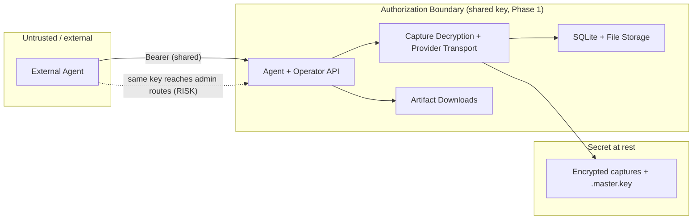

# Security Model — AI Agent → ChatGPT API Bridge

> States the **current security reality** honestly. Does not imply controls
> that do not exist (`CLAUDE.md` §8, §16). No real credential is exposed
> here.

## 1. Current security reality (verified)

- **One shared Bearer key** (`CHATGPT_API_KEY`, default `local-dev-key`).
  `authorize()` (`http_utils.py:11`).
- **Unset key ⇒ all routes open** (`http_utils.py:13`).
- **No RBAC, no tenant isolation, no per-client keys.**
- **Agent and operator endpoints share the same authorization boundary** —
  an external agent with the shared key **can** reach `/v1/chatgpt/admin/*`
  including account-capture management. This is a real risk for any
  non-isolated deployment.
- **CORS `*`** (`http_utils.py:34`, `openai_compat.py:2273`).
- **Operator/admin routes are not a privileged role** — same key.
- **Artifact downloads** are gated by the same shared key; generated content
  (images, research) is exposed to anyone with bridge access.
- **Captures are credentials**, encrypted at rest (`crypto.py`, Fernet
  `enc:v1:`); key from runtime passphrase > env > auto `.master.key` (0600
  POSIX, not Windows).
- **Local-first deployment assumption** — `127.0.0.1` bind by default;
  `0.0.0.0` only for Docker/LAN.

## 2. Current Phase 1 — private LAN / internal use

Required hardening considerations. Items marked proposed are not implemented
and must not be described as current controls:

- **Require a non-default API key** in production mode; refuse to start with
  `local-dev-key` when a `PRODUCTION=1`-style flag is set (proposed).
- **Do not allow an unset API key** in production mode.
- **Bind only to trusted interfaces**; firewall ports `8000/8080/3000`.
- **Restrict CORS** — proposed `CHATGPT_ALLOWED_ORIGINS` env (currently
  hardcoded `*`); Phase 1 may keep `*` only for true loopback.
- **Logically separate agent routes** (`/v1/agent/*`) from operator routes
  (`/v1/chatgpt/admin/*`) — a separate `CHATGPT_AGENT_API_KEY` is a future
  proposal, not implemented. Today both surfaces use `CHATGPT_API_KEY`.
- **Request-size limits** (25 MiB) + **MIME validation** + **filename
  sanitization** at the agent endpoint.
- **Redacted logs** — reuse `redacted_headers()`, `to_redacted_dict()`,
  `_public_status_error()`. Never log request bodies containing images.
- **Never return capture content, cookies, browser tokens, sentinel/proof
  tokens, or keys** in any agent/operator response.
- **Artifact path isolation** — job artifacts under `outputs/agent-jobs/`;
  path-traversal prevention via opaque server-generated IDs.
- **Callbacks disabled by default**; if enabled, an allowlist + SSRF
  protection (block link-local/private IPs, scheme allowlist `https`).
- **SSRF protection** for remote image URLs and callback URLs (resolve +
  reject private/loopback ranges).
- **Upload retention** + safe deletion.
- **Rate limiting / concurrency** — reuse `BoundedSemaphore` per-account/
  per-feature limits; add a per-key submission rate cap (proposed).

## 3. Threat boundary

**Key risk (current Phase 1):** the shared key gives any agent full operator
access. Current mitigation is deployment isolation: keep the bridge private
and off the public internet. A separate agent key remains a future proposal.

## 4. Trust boundaries

- External agent ↔ API: shared Bearer (Phase 1).
- API ↔ provider transport: in-process, trusted.
- API ↔ storage: local filesystem + SQLite, trusted (single host).
- API ↔ captures: encrypted at rest; decrypted only in memory during a
  provider call.

## 5. Agent vs operator access

- **Current through Phase 1C.4 (shipped, 2026-06-28):** the `/v1/agent/*` routes use the
  **same shared `CHATGPT_API_KEY`** as every other protected route via the
  existing `authorize()` gate. There is **no agent/operator isolation** — an
  agent holding the shared key can still reach `/v1/chatgpt/admin/*`
  including account-capture management. A separate `CHATGPT_AGENT_API_KEY`
  is **not implemented** (deferred). Phase 1 deployments must remain
  private/trusted.
- **Future auth hardening (proposed, not implemented):** two env vars —
  `CHATGPT_API_KEY` (operator/admin) and `CHATGPT_AGENT_API_KEY` (agent
  routes only). Agent key cannot reach `/v1/chatgpt/admin/*`. If
  `CHATGPT_AGENT_API_KEY` is unset, agent routes fall back to
  `CHATGPT_API_KEY` (single-key compat) but a startup warning is emitted.
- **UI is never the boundary** — all gating is in `authorize()`-equivalent
  checks on the backend.

## 6. Secret handling

- Captures/cookies/tokens/keys/passphrases: never logged, never returned,
  never committed. Reuse the `capture-credentials-safety` skill rules.
- API keys: store only as env/process state; never echo the configured key
  (the console integration page uses a `<API_KEY>` placeholder).

## 7. Upload security

- MIME allowlist + magic-byte sniff; size limits; opaque IDs; path
  traversal prevention; quarantine orphan files.

## 8. Download security

- `file_id` resolved from SQLite (never from URL path); filename from the
  stored row; same-key gate (Phase 1). Signed URLs are Phase 5.

## 9. Callback security

- Disabled by default. If enabled: HTTPS-only, host allowlist, SSRF
  private-IP blocking, retry with backoff, redacted payload, timeout.

## 10. SSRF risks

- Remote image URLs (`image_inputs.py` fetches public URLs) and callback
  URLs are SSRF vectors. Proposed: resolve and reject private/loopback/
  link-local ranges; cap redirect depth; scheme allowlist.

## 11. Multi-client future (Phase 5 — does not exist yet)

- Per-client API keys (hashed), capability scopes, per-client quotas,
  tenant-aware job/artifact ownership, separate operator authorization,
  audit logs, signed artifact URLs, secret vault integration, client
  revocation/rotation, per-client retention + callback policy.

**These do not exist in the current code. Do not claim otherwise.**

## 12. Security progression summary

| Phase | Auth | Tenancy | CORS | TLS | Callbacks |
| --- | --- | --- | --- | --- | --- |
| Current | 1 shared key | none | `*` | none | none |
| Future hardening | shared + proposed agent key | none | restricted (proposed) | behind proxy | disabled/allowlist |
| Phase 5 | per-client keys + scopes | tenant-aware | restricted | proxy | per-client policy |
