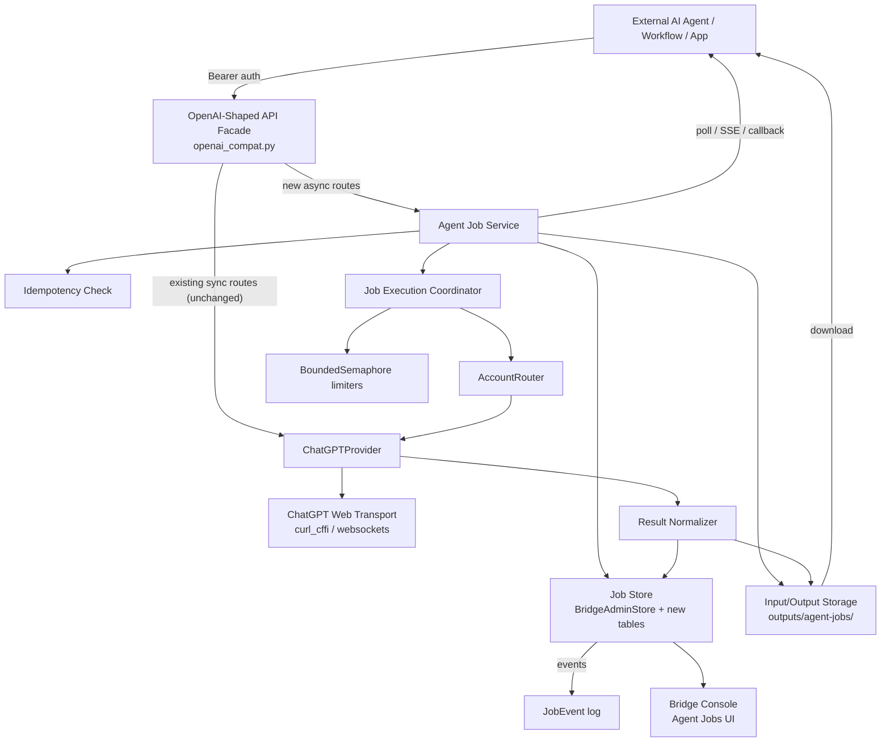

# Target Architecture — AI Agent → ChatGPT API Bridge

> Design only. Grounded in repository evidence on 2026-06-27. Additive to the
> existing synchronous OpenAI-shaped routes — does not replace them.

## 1. Target component diagram

## 2. Request lifecycle (asynchronous job)

1. Agent `POST /v1/agent/jobs` with Bearer key + optional `Idempotency-Key`.
2. `authorize()` validates the key (`http_utils.py:11`).
3. **Idempotency check** — if key exists and matches a prior request_hash,
   return the existing job; if same key + different payload → 409.
4. **Validate** request type + model + inputs (MIME/size/count limits).
5. **Persist** `AgentJob` row (status `accepted`), request JSON to disk,
   uploaded inputs to disk (with `sha256`).
6. Transition `accepted → queued`.
7. **Coordinator** picks the next `queued` job (SQLite poll, single-process).
8. `AccountRouter.order()` + preflight quota select an account
   (`openai_compat.py:91,714`).
9. Acquire per-feature + per-account `BoundedSemaphore`
   (`_FEATURE_LIMITERS:228`, `_ACCOUNT_LIMITERS:225`).
10. Transition `queued → running`; record `JobAttempt`.
11. `ChatGPTProvider` executes via existing transport (chat / image /
    vision / research).
12. Stream deltas (if chat+SSE job) → append `JobEvent`s.
13. Normalize result; persist `JobResult` + artifacts (reuse `artifacts`
    table + download path); transition `running → succeeded` (or `failed`).
14. Agent retrieves via `GET /v1/agent/jobs/{id}/result` + artifact
    download, or receives callback, or polls `GET /v1/agent/jobs/{id}`.

## 3. Job lifecycle / state machine

See `DATA_MODEL.md` for the full state machine and Mermaid diagram. Summary:
`accepted → validating → queued → running → (streaming) → succeeded | failed
| cancelled`; with `retry_wait` and `cancel_requested` side states. Terminal:
`succeeded`, `failed`, `cancelled`, `expired`.

## 4. Storage architecture

- **Metadata (source of truth):** SQLite via `BridgeAdminStore` (extend
  `_migrate()`). Job/attempt/event/result rows + artifact rows.
- **Binaries + large text:** local filesystem `outputs/agent-jobs/<job_id>/`
  (`request.json`, `inputs/`, `results/`, `artifacts/`). Reuse existing
  `artifacts` table for downloadable artifacts so the existing
  `/v1/chatgpt/files/{file_id}/{filename}` download path works unchanged.
- **No Redis / S3 / PostgreSQL in Phase 1.** See `STORAGE_DESIGN.md` for the
  future `ArtifactStorage` protocol + migration triggers.

## 5. Worker architecture (Phase 1)

- **In-process coordinator** — a single background thread (or
  `ThreadingHTTPServer` worker) that polls SQLite for `queued` jobs, claims
  one via an atomic `UPDATE … WHERE status='queued' … RETURNING`-style
  claim, and runs it through the existing provider path.
- **Effectively-once:** idempotency key prevents duplicate external
  submissions; a `lease_owner` + `lease_expires_at` (process id + heartbeat)
  lets a restarted process reclaim `running` jobs whose lease expired.
- **No separate worker process in Phase 1** — the API process owns the
  coordinator. (Objective scale-out triggers in `STORAGE_DESIGN.md`.)

## 6. Provider reuse

The coordinator calls the **same** `ChatGPTProvider` + `AccountRouter` +
limiters the synchronous routes use. No transport redesign. Deep Research
jobs reuse the `chatgpt-deep-research` alias and normal (non-temporary) chat
mode; cancellation reuses the existing `_stop_chatgpt_operation` best-effort
flow, now driven by the durable job state instead of the in-memory dict.

## 7. Error flow

- Provider errors normalized to OpenAI-shaped error objects with `code`
  (`chatgpt_model_limit`, `chatgpt_rate_limited`,
  `chatgpt_unsupported_model`, `chatgpt_auth_or_browser_challenge`).
- Retryable vs terminal classification in `IMPLEMENTATION_ROADMAP.md` §retry.
- Expired/invalid captures → **terminal** (not endlessly retried).
- Errors persisted on `AgentJob.error_code`/`error_message` + `JobAttempt`;
  redacted via `_public_status_error` before any operator/agent display.

## 8. Retry flow

- Retryable errors → `running → retry_wait` with backoff, then
  `retry_wait → queued` for the next attempt (new `JobAttempt` row,
  account failover via `AccountRouter`).
- `max_attempts` cap; terminal on cap reached.

## 9. Restart recovery

- On startup, the coordinator scans for `running` jobs whose `lease_expires_at`
  < now (or whose `lease_owner` is not this process).
  - If the lease is stale → mark `running → queued` (re-queue) or
    `running → failed` (if no attempts remain), per policy.
  - In-memory provider operation state (`_CHATGPT_OPERATIONS`) is **not**
    restored; the durable job re-drives the provider call as a new attempt.
- `accepted`/`queued`/`retry_wait` jobs survive restart in SQLite and resume.

## 10. Deployment topology

- Unchanged: Docker Compose three-service stack
  (`chatgpt-api`, `bridge-console`, `character-game`). The agent-job layer
  lives inside the `chatgpt-api` container/process; the UI lives in
  `bridge-console`. No new containers in Phase 1.
- Volumes unchanged: `./secrets/accounts`, `./outputs` (now also holding
  `outputs/agent-jobs/`).

## 11. Future scaling path

- Phase 4 (only when triggers met): separate worker container, external
  broker (Redis) for lease coordination, S3-compatible artifact storage,
  PostgreSQL for relational scale. See `STORAGE_DESIGN.md`.

## 12. UI-to-backend architecture

- Console `apiFetch` calls new `/v1/agent/jobs*` + existing admin routes.
- Console is **stateless**; all state is the backend's. UI never holds
  secrets. Polling is controlled (no fake real-time); SSE only where the
  backend supports it (`/events`, Phase 3).
