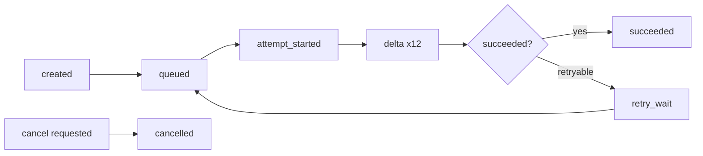
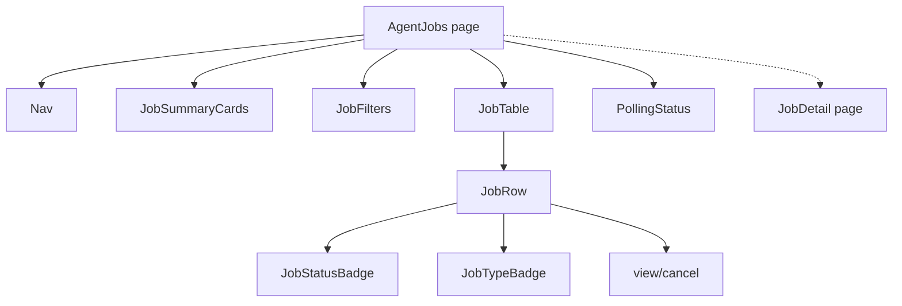

# UI Wireframes — Agent Job Bridge Console

> Low-fidelity text/Mermaid wireframes to lock workflow, information
> hierarchy, API requirements, states, actions, navigation. Not polished
> assets. Extends `apps/bridge-console`.

## Navigation shell

```text
┌──────────────────────────────────────────────────────────────┐
│ [logo] Bridge Console        [base url▾] [key•]   [refresh]   │
│ Overview | Agent Jobs | Submit Test | Queue | Accounts |      │
│ Artifacts | Integration | Settings                            │
├──────────────────────────────────────────────────────────────┤
│                                                                │
│                    < page content >                            │
│                                                                │
└──────────────────────────────────────────────────────────────┘
```

Hash-routed; nav collapses to a menu on tablet.

## 1. Agent Jobs Dashboard

```text
┌─ Agent Jobs ───────────────────────────────────────────────────┐
│ Summary:  [Queued 3] [Running 1] [Retry 0] [Succeeded 42]      │
│           [Failed 2] [Cancelled 1]  Oldest queued: 4m  Avg: 38s│
│                                                                │
│ Filters: [search____] [status▾] [type▾] [model▾] [account▾]    │
│          [date range] [error_code▾]      [Apply] [Clear]       │
│                                                                │
│ ┌──Job──────┬ClientReq──┬Type──┬Status──┬Model──┬Acct──┬Att┬─ │
│ │ job_01AB… │ run-123    │ chat │ Running │ auto  │ main │ 1 │ │
│ │ job_01CD… │ camp-77-1  │ img  │ Succ.   │ gpt-… │ img  │ 1 │ │
│ │ job_01EF… │ research42 │ res  │ Failed  │ deep… │ res  │ 3 │ │
│ └─────────────────────────────────────────────────────────────┘ │
│  ← 1 2 3 →    showing 1–50 of 142        [auto-refresh 5s ●]    │
└────────────────────────────────────────────────────────────────┘
```

States: loading skeleton; empty "No jobs yet → Submit Test"; error banner;
no-results "No jobs match filters"; API-unavailable "Bridge unreachable".

## 2. Submit Text Job

```text
┌─ Submit Test · Chat ───────────────────────────────────────────┐
│ Mode: (•) Asynchronous job   ( ) Synchronous (test-lab)         │
│ Model: [auto ▾]   Stream: [ ]                                  │
│ System: [_____________________________________________]         │
│ User:   [_____________________________________________]         │
│         [_____________________________________________]         │
│ Prior messages: (optional)  [+ add turn]                       │
│ Client request id: [agent-run-123]                             │
│ Idempotency key:   [agent-run-123-step-4]                      │
│                                            [Reset] [Submit ▸]  │
│ → on accept: "Submitted job_01…" [Open job →]                  │
│ → on 409: "Idempotency key in use" [Open existing →]           │
└────────────────────────────────────────────────────────────────┘
```

## 3. Submit Image Job

```text
┌─ Submit Test · Image Generation ───────────────────────────────┐
│ Model: [gpt-image-1 ▾]   Size: [1024x1024 ▾]                   │
│ Prompt: [_____________________________________________]         │
│ Client request id: [campaign-77-frame-1]                       │
│ Idempotency key:   [campaign-77-frame-1-v1]                    │
│                                            [Reset] [Submit ▸]  │
└────────────────────────────────────────────────────────────────┘
```

Vision upload variant: file picker + drag-drop, MIME/size validation inline
("image/png · 1.2 MiB ✓"; "image/heic · unsupported"), up to 10.

## 4. Job Detail

```text
┌─ Job job_01AB…  [Running ●]  [Cancel] [Retry (P2)]────────────┐
│ Type: chat   Model: auto   Account: main-free   Attempts: 1   │
│ Client req: run-123   Idempotency: ag…123-step-4 (partial)    │
│ Created 12:00 · Queued 12:00 · Started 12:01 · (running)      │
│                                                                │
│ ▸ Timeline  [created]→[queued]→[attempt_started]→[delta×12]…  │
│ ▸ Attempts  #1 main-free · running                             │
│ ▸ Request payload (redacted)   {model, messages, …}  [copy]   │
│ ▸ Inputs   (none)                                              │
│ ▸ Result   (pending… / or text + raw response [copy])         │
│ ▸ Artifacts  [icon.png ▸ preview] [download]                  │
│ ▸ Error    (none / redacted code + message)                   │
└────────────────────────────────────────────────────────────────┘
```



## 5. Queue and Execution Status

```text
┌─ Queue & Execution ────────────────────────────────────────────┐
│ Coordinator: in-process · pid 1234 · last heartbeat 2s ago     │
│ [Queued 3] [Running 1] [Retry 0]  Oldest queued: 4m            │
│ Active job: job_01AB… (chat, main-free)                        │
│ Per-account concurrency: main-free 1/1 · image-pro 0/1         │
│ Per-capacity: chat 1/1 · image 0/1 · research 0/1 · upload 0/1 │
│ Waiting for capacity: 0                                        │
│ Stale-running: 0      Restart recoveries today: 1              │
│ Recent failures: job_01EF… (chatgpt_auth_or_browser_challenge) │
│ Last success: 38s ago                                          │
└────────────────────────────────────────────────────────────────┘
```

## 6. Storage and Artifact Status

```text
┌─ Storage & Artifacts ──────────────────────────────────────────┐
│ Artifacts: 128 (image 96 · research 32)   Usage: ~1.4 GiB      │
│ Input storage: 12 MiB   Result storage: 8 MiB                  │
│ Expired (pending cleanup): 4   Missing files: 0   Orphans: 0   │
│ Failed cleanups: 0   Last cleanup: 2026-06-27 03:00            │
│ Retention: 7 days terminal    Reconciliation: ok (2m ago)      │
│ [Run reconciliation now]  [Run cleanup now]                    │
└────────────────────────────────────────────────────────────────┘
```

## 7. Integration Page

```text
┌─ Agent Integration ────────────────────────────────────────────┐
│ Base URL:        http://<PRODUCTION_HOST>:8000/v1              │
│ Auth header:     Authorization: Bearer <API_KEY>               │
│ Submit job:      POST /v1/agent/jobs                           │
│ List jobs:       GET  /v1/agent/jobs                           │
│ Status:          GET  /v1/agent/jobs/{job_id}                  │
│ Result:          GET  /v1/agent/jobs/{job_id}/result           │
│ Cancel:          POST /v1/agent/jobs/{job_id}/cancel           │
│ Events:          GET  /v1/agent/jobs/{job_id}/events           │
│ Artifacts:       GET  /v1/agent/jobs/{job_id}/artifacts        │
│                                                                │
│ [curl example ▾]  [python client ▾]  [idempotency ▾]           │
│ Limits: 25 MiB request · 20 MiB/image · 10 images              │
│ Supported: chat, image_generation, image_edit, vision,         │
│           deep_research                                        │
│ Unsupported: masks, n>1, native tool-call API, token usage     │
└────────────────────────────────────────────────────────────────┘
```

## Component tree (dashboard)



## State matrix (dashboard)

| State | Trigger | Render |
| --- | --- | --- |
| loading | first fetch | skeleton rows |
| empty | 0 jobs total | "No jobs yet → Submit Test" |
| no-results | filters match 0 | "No jobs match filters" + Clear |
| error | fetch non-2xx | redacted banner + retry |
| auth | 401 | "Unauthorized — check key in Settings" |
| unavailable | network/timeout | "Bridge unreachable" + stale data |
| partial | some endpoints fail | available data + degraded badge |
